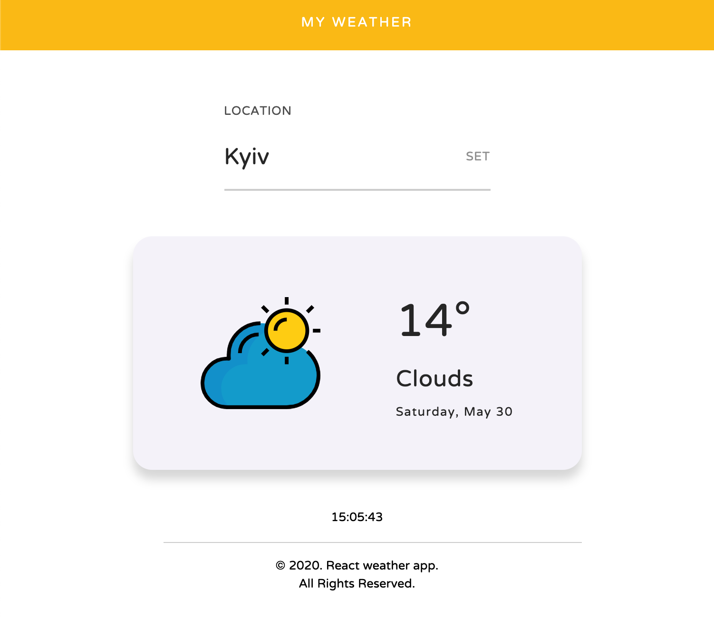

# react-weather-app [](https://app.netlify.com/sites/pwa-react-weather-app/deploys)

Progressive Web App created using React.js and Open Weather API.


## Getting started

- Sign up over at [openweathermap.org](https://openweathermap.org/appid) to get an API key.
- Fork the project and clone it locally.
- Create a file at the root of the project called `.env` with the following contents:

```sh
REACT_APP_API_URL = 'https://api.openweathermap.org/data/2.5/weather'
REACT_APP_WEATHER_API_KEY = The API key you obtained from openweathermap.org
```

---
[Watch app here](https://pwa-react-weather-app.netlify.app)


